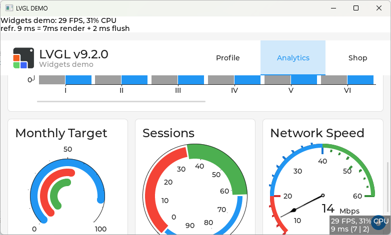

# lvgl tutorial@windows os

This repo is to run tutorial app in windows platform, develop with vscode + cmake.



## Requirement

1. Install [vistual studio 2022](https://visualstudio.microsoft.com/downloads/)

2. Install cmake, open powershell, and install with winget

    ```powershell
    winget install cmake
    ```

3. Install c/c++ vscode extension

## Build and run

* Configure tutorial

    ```powershell
    cmake --preset tutorial
    ```

* Build executable

    ```powershell
    cmake --build . --preset tutorial --target quickstart -- /maxcpucount:4

    # clean
    cmake --build . --preset tutorial --target clean
    ```

* Run quickstart

    ```powershell
    .\out\build\tutorial\quickstart\Debug\quickstart.exe
    ```
